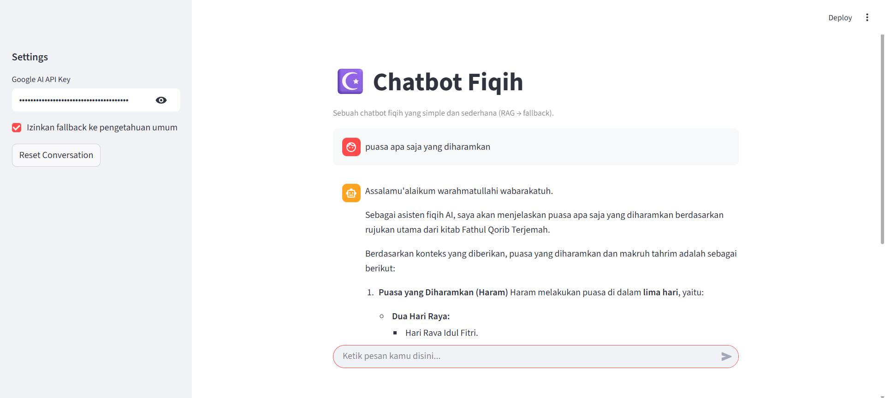

# ☪️ Chatbot Fiqih  
Chatbot interaktif berbasis **LangChain + Gemini + Streamlit** untuk membantu pengguna belajar dasar-dasar **ilmu fiqih** dari terjemahan kitab digital seperti *Fathul Qorib*.


---

## 🧩 Fitur Utama
- 🔍 **RAG (Retrieval-Augmented Generation)** — chatbot menjawab berdasarkan isi kitab fiqih yang sudah diindeks ke FAISS.
- 🤖 **LLM Gemini** — menggunakan model `gemini-2.5-flash` dari Google untuk menghasilkan jawaban yang natural dan kontekstual.
- 🧠 **Fallback ke pengetahuan umum** — jika konteks dari PDF tidak ditemukan, chatbot otomatis menjawab menggunakan pengetahuan umum fiqih.
- 🗂️ **Debug Mode** — menampilkan info FAISS index, jumlah vektor, dan konteks yang digunakan setiap kali chatbot menjawab.
- 💬 **UI Streamlit** — tampilan chat sederhana dengan indikator proses otomatis dan riwayat percakapan.

---

## 🏗️ Struktur Proyek
```
CHATBOT-FIQIH/
│
├── data_pdfs/
│   └── Fathul Qorib Terjemah.pdf      # file sumber fiqih
│
├── vectorstore/                       # penyimpanan index FAISS
│   ├── fiqih_faiss.faiss
│   └── fiqih_faiss.pkl
│
├── build_index.py                     # script untuk membangun index dari PDF
├── chatbot_fiqih_app.py               # aplikasi utama Streamlit
├── requirements.txt                   # daftar dependensi
├── .gitignore
└── README.md
```

---

## ⚙️ Cara Instalasi & Menjalankan Chatbot

### 🪜 1. Clone repository
Pastikan sudah install `git`, lalu jalankan:
```bash
git clone https://github.com/mafifanars/chatbot-fiqih.git
cd chatbot-fiqih
```

---

### 🧱 2. Buat virtual environment
Gunakan environment terpisah supaya dependency tidak bentrok.

#### 🪟 **Windows**
```bash
python -m venv chatbot-fiqih-env
chatbot-fiqih-env\Scripts\activate
```

#### 🐧 **Linux / macOS**
```bash
python3 -m venv chatbot-fiqih-env
source chatbot-fiqih-env/bin/activate
```

---

### 📦 3. Install dependensi
Pastikan file `requirements.txt` ada, lalu jalankan:
```bash
pip install -r requirements.txt
```

> Jika ada error pada FAISS di Windows, pastikan kamu pakai `faiss-cpu`, bukan versi GPU.

---

### 📚 4. Siapkan file PDF sumber
Letakkan file PDF kitab fiqih kamu di folder:
```
data_pdfs/
```
Contoh:  
`data_pdfs/Fathul Qorib Terjemah.pdf`

---

### 🧠 5. Bangun index FAISS
Langkah ini perlu dilakukan **sekali saja** (atau jika kamu ganti PDF):
```bash
python build_index.py
```
Output-nya:
```
✅ index rebuilt
```
Akan membuat dua file baru di folder `vectorstore/`:
```
fiqih_faiss.faiss
fiqih_faiss.pkl
```

---

### 🚀 6. Jalankan aplikasi Streamlit
Setelah index siap, jalankan chatbot:
```bash
streamlit run chatbot_fiqih_app.py
```

Aplikasi akan terbuka otomatis di browser:  
👉 [http://localhost:8501](http://localhost:8501)

---

### 🔑 7. Masukkan API Key Gemini
1. Buka aplikasi di browser  
2. Masukkan API Key kamu di kolom **“Google AI API Key”** (sidebar kiri)  
3. Dapatkan key di sini:  
   🔗 [https://makersuite.google.com/app/apikey](https://makersuite.google.com/app/apikey)

Atau buat file `.env` berisi:
```
GOOGLE_API_KEY=your_api_key_here
```

---

### 💬 8. Mulai Chatting
Ketik pertanyaan seputar fiqih, misalnya:
```
Apa hukum tayamum jika tidak ada air?
Puasa apa saja yang dimakruhkan?
```

Jika konteks ada di PDF, chatbot akan menjawab berdasarkan kitab.  
Jika tidak, chatbot akan berpindah ke mode **Fallback** (pengetahuan umum LLM).

---

## 📚 Teknologi yang Digunakan
| Komponen | Fungsi |
|-----------|---------|
| **LangChain** | Pipeline RAG & manajemen vectorstore |
| **FAISS** | Penyimpanan embedding teks |
| **Sentence Transformers** | Model embedding `paraphrase-multilingual-MiniLM-L12-v2` |
| **Google Gemini API** | LLM untuk reasoning & jawaban |
| **Streamlit** | Antarmuka web interaktif |

---
